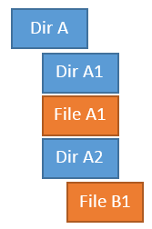

# Lab: Extracting Data from the Repository
In this lab, we will cover the following recipes:

- Extracting the top contributor
- Finding bottlenecks in the source tree
- Grepping the commit messages

#### Introduction
Whether you work in big or small organizations, safeguarding and maintaining data is always important and it keeps track of a fair amount of information for you; it is just a matter of extracting the data. Some of the data is included in the system by you or any other developer when the commit message is filled in with the proper information – for instance, details of the bug you are fixing from the bug tracking system.

The data is not only valid for management but can also be used to add more time to refactor the C files, where almost all bugs are fixed.

#### Pre-reqs:
- Google Chrome (Recommended)

#### Lab Environment
There is no requirement for any setup.

**Important:** Instructions for this lab are written in such a way that it also shows expected output from the git cli. Only run commands that start with **$** as shown below.


Extracting the top contributor
------------------------------

Git has a few built-in stats you can get instantaneously. The
`git log` command has different options, such as
`--numstat`, that will show the number of files added and
lines deleted for each file since each commit. However, for finding the
top committer in the repository, we can just use the
`git shortlog` command.

 

### Getting ready

For all the examples throughout the book, we are using the
`jgit` repository; you can either clone it or go to one of the
clones you might already have.

Clone the `jgit` repository as follows:

```
$ git clone https://git.eclipse.org/r/jgit/jgit lab11 
$ cd lab11 
```

### How to do it...

The `shortlog` Git command is very simple and does not have a
lot of options or flags to use with it. It can show the log but in a
boiled-down version, and then it can summarize it for us as follows:

1.   Start by showing the last five commits with `shortlog` .
    We can use `-5` to limit the amount of output:

```
$ git shortlog -5 
Jonathan Nieder (1): 
  Update commons-compress to 1.6 
 
Matthias Sohn (2): 
  Update com.jcraft.jsch to 0.1.50 in Kepler target platform 
  Update target platforms to use latest orbit build 
 
SATO taichi (1): 
  Add git checkout --orphan implementation 
 
Stefan Lay (1): 
  Fix fast forward rebase with rebase.autostash=true 
```

2.  As you can see, the output is very different from the
    `git log` output. You can try it for yourself with
    `git log -5` . The numbers in parentheses are the number of
    commits by that committer. Beneath the name and number are the
    commit titles of the commits. Note that no commit hashes are shown.
    To find the top committer with just those five commits is easy, but
    when you try running `git shortlog` without
    `-5`, it is hard to find that person. To sort and find the
    top committer, we can use the `-n` or
    `--numbered` option to sort the output; the top committer
    is on top:

```
$ git shortlog -5 --numbered 
Matthias Sohn (2): 
      Update com.jcraft.jsch to 0.1.50 in Kepler target platform 
      Update target platforms to use latest orbit build 
 
Jonathan Nieder (1): 
      Update commons-compress to 1.6 
 
SATO taichi (1): 
      Add git checkout --orphan implementation 
 
Stefan Lay (1): 
      Fix fast forward rebase with rebase.autostash=true 
```

3.   As you can see, the output is nicely sorted. If we don't care about
    the commit subjects, we can use`-s` or
    `--summary` to only show the commit count for each
    developer as follows:

```
$ git shortlog -5 --numbered --summary 
     2  Matthias Sohn 
     1  Jonathan Nieder 
     1  SATO taichi 
     1  Stefan Lay 
```

4.  Finally, we have what we want, except that we don't have the email
    addresses of the committers; this option is also available with
    `-e` or `--email` . This will also show the email
    addresses of the committers in the list. This time, we will try it
    on the entire repository. Currently, we have only listed it for
    theHEADcommit. To list it for the repository, we need to
    add`--all` at the end of the command so as to execute the
    command for all branches as follows:

```
$ git shortlog  --numbered --summary --email --all 
   765  Shawn O. Pearce <spearce@spearce.org> 
   399  Matthias Sohn <matthias.sohn@sap.com> 
   360  Robin Rosenberg <robin.rosenberg@dewire.com> 
   181  Chris Aniszczyk <caniszczyk@gmail.com> 
   172  Shawn Pearce <spearce@spearce.org> 
   160  Christian Halstrick <christian.halstrick@sap.com> 
   114  Robin Stocker <robin@nibor.org>
```

5.  So, this is the list now; we know who contributed with the most
    commits, but this picture can be a little skewed, as the top
    committer may just happen to be the creator of the project and may
    not actively contribute to the repository. So, to list the top
    committers for the last six months, we can add
    `--since="6 months ago"` to the `git shortlog` 
    command as follows:

```
$ git shortlog  --numbered --summary --email --all --since="6 months ago" 
    73  Matthias Sohn <matthias.sohn@sap.com> 
    15  Robin Stocker <robin@nibor.org> 
    14  Robin Rosenberg <robin.rosenberg@dewire.com> 
    13  Shawn Pearce <sop@google.com> 
    12  Stefan Lay <stefan.lay@sap.com> 
     8  Christian Halstrick <christian.halstrick@sap.com> 
     7  Colby Ranger <cranger@google.com> 
```

6.  As you can see, the picture has changed since the start of the
    repository.

### Note

You can use *"n weeks ago"*, *"n days ago"*, *"n months ago"*, *" n
hours ago"*, and so on for specifying time periods. You can also use
specific dates, such as `"1 october 2013"` .

You can also list the top committer for a specific month using the
`--until` option, where you can specify the date you wish to
list the commit until. This can be done as follows:

```
$ git shortlog  --numbered --summary --email --all --since="30 september 2013" --until="1 november 2013" 
    15  Matthias Sohn <matthias.sohn@sap.com> 
     4  Kaloyan Raev <kaloyan.r@zend.com> 
     4  Robin Rosenberg <robin.rosenberg@dewire.com> 
     3  Colby Ranger <cranger@google.com> 
     2  Robin Stocker <robin@nibor.org> 
     1  Christian Halstrick <christian.halstrick@sap.com> 
     1  Michael Nelson <michael.nelson@tasktop.com> 
     1  Rüdiger Herrmann <ruediger.herrmann@gmx.de> 
     1  Tobias Pfeifer <to.pfeifer@web.de> 
     1 Tomasz Zarna <tomasz.zarna@tasktop.com>
```

7.  As you can see, we get another list, and it seems like Matthias is
    the main contributor, at least compared to the initial result. These
    types of data can also be used to visualize the shift of
    responsibility in a repository by collecting the data for each month
    since the repository's initialization.

 

### There's more...

While working with code, it is often useful to know who to go to when
you need to perform a fix in the software, especially in an area where
you are inexperienced. So, it would be nice to figure out who is the
code owner of the file or the files you are changing. The obvious reason
is to get some input on the code, but also to know who to go to for a
code review. You can again use`git shortlog` to figure this
out. You can use the command on the files as well:

1.  To do this, we simply add the file to the end of the
    `git shortlog` command:

```
$ git shortlog  --numbered --summary --email ./pom.xml 
    86  Matthias Sohn <matthias.sohn@sap.com> 
    21  Shawn O. Pearce <spearce@spearce.org> 
     4  Chris Aniszczyk <caniszczyk@gmail.com> 
     4  Jonathan Nieder <jrn@google.com> 
     3  Igor Fedorenko <igor@ifedorenko.com> 
     3  Kevin Sawicki <kevin@github.com> 
     2  Colby Ranger <cranger@google.com> 
```

2.  As for `pom.xml`, we also have a top committer. As all the
    options you have for `git log` are available for
    `shortlog`, we can also do this on a directory as follows:

```
$ git shortlog  --numbered --summary --email org.eclipse.jgit.lfs.server.test
    35 Matthias Sohn <matthias.sohn@sap.com>
    20 David Pursehouse <david.pursehouse@gmail.com>
     4 Markus Duft <markus.duft@ssi-schaefer.com>
     2 Saša Živkov <sasa.zivkov@sap.com>
     1 David Ostrovsky <david@ostrovsky.org>
     1 Mat Booth <mat.booth@redhat.com>
     1 Karsten Thoms <karsten.thoms@itemis.de>
```

3.   As you can see, it is fairly simple to get some indication of who
    to go to for the different files or directories in Git.

Finding bottlenecks in the source tree
--------------------------------------

* * * * *

Often, the development teams know where the bottleneck in the source
tree is, but it can be challenging to convince the management that you
need resources to rewrite some code. However, with Git, it is fairly
simple to extract that type of data from the repository.

 

### Getting ready

Start by checking out the stable-3.1 release as follows:

```
$ git checkout stable-3.1 
Branch stable-3.1 set up to track remote branch stable-3.1 from origin. 
Switched to a new branch 'stable-3.1' 
```

### How to do it...

We want to start by listing some stats for one commit, and then we can
extend the examples to larger chunks of commits:

1.  The first option we will be using is `--dirstat` for
    `git log` as follows:

```
$ git log -1 --dirstat 
commit da6e87bc373c54c1cda8ed563f41f65df52bacbf 
Author: Matthias Sohn <matthias.sohn@sap.com> 
Date:   Thu Oct 3 17:22:08 2013 +0200 
 
    Prepare post 3.1.0 builds 
 
    Change-Id: I306a3d40c6ddb88a16d17f09a60e3d19b0716962 
    Signed-off-by: Matthias Sohn <matthias.sohn@sap.com> 
 
   5.0% org.eclipse.jgit.http.server/META-INF/ 
   6.9% org.eclipse.jgit.http.test/META-INF/ 
   3.3% org.eclipse.jgit.java7.test/META-INF/ 
   4.3% org.eclipse.jgit.junit.http/META-INF/ 
   6.6% org.eclipse.jgit.junit/META-INF/ 
   5.5% org.eclipse.jgit.packaging/ 
   5.9% org.eclipse.jgit.pgm.test/META-INF/ 
  13.7% org.eclipse.jgit.pgm/META-INF/ 
  15.4% org.eclipse.jgit.test/META-INF/ 
   3.7% org.eclipse.jgit.ui/META-INF/ 
  13.1% org.eclipse.jgit/META-INF/
```

 

2.   The `--dirstat` option shows which directories have
    changed in the commit and how much they have changed compared to
    each other. The default setting is to count the number of lines
    added to or removed from the commit. So, rearranging the code
    potentially does not count for any change, as the line count might
    be the same. You can compensate for this slightly by using
    `--dirstat=lines` . This option will look at each file line
    by line and see whether they have changed compared to the previous
    version as follows:

```
$ git log -1 --dirstat=lines 
commit da6e87bc373c54c1cda8ed563f41f65df52bacbf 
Author: Matthias Sohn <matthias.sohn@sap.com> 
Date:   Thu Oct 3 17:22:08 2013 +0200 
 
    Prepare post 3.1.0 builds 
 
    Change-Id: I306a3d40c6ddb88a16d17f09a60e3d19b0716962 
    Signed-off-by: Matthias Sohn <matthias.sohn@sap.com> 

   4.8% org.eclipse.jgit.http.server/META-INF/ 
   6.5% org.eclipse.jgit.http.test/META-INF/ 
   3.2% org.eclipse.jgit.java7.test/META-INF/ 
   4.0% org.eclipse.jgit.junit.http/META-INF/ 
   6.1% org.eclipse.jgit.junit/META-INF/ 
   6.9% org.eclipse.jgit.packaging/ 
   5.7% org.eclipse.jgit.pgm.test/META-INF/ 
  13.0% org.eclipse.jgit.pgm/META-INF/ 
  14.6% org.eclipse.jgit.test/META-INF/ 
   3.6% org.eclipse.jgit.ui/META-INF/ 
  13.8% org.eclipse.jgit/META-INF/ 
```

3.  This also gives a slightly different result. If you would like to
    limit the output to only show directories with a certain percentage
    or higher, we can limit the output as follows:

```
$ git log -1 --dirstat=lines,10 
commit da6e87bc373c54c1cda8ed563f41f65df52bacbf 
Author: Matthias Sohn <matthias.sohn@sap.com> 
Date:   Thu Oct 3 17:22:08 2013 +0200 
 
    Prepare post 3.1.0 builds 
    Change-Id: I306a3d40c6ddb88a16d17f09a60e3d19b0716962 
    Signed-off-by: Matthias Sohn <matthias.sohn@sap.com> 
 
  13.0% org.eclipse.jgit.pgm/META-INF/ 
  14.6% org.eclipse.jgit.test/META-INF/ 
  13.8% org.eclipse.jgit/META-INF/
```

 

4.  By adding `10` to the `--dirstat=lines` command,
    we are asking Git to only show the directories that have 10 percent
    or higher changes; you can use any number you like here. By default,
    Git does not count the changes in the subdirectories, but only the
    files in the directory. So, in the following diagram, only changes
    in **File A1** are counted as changes; for the **Dir A1** directory
    and the **File B1** file, it is counted as a change in **Dir A2**:



5.  To cumulate this, we can add `cumulative` to the
    `--dirstat=lines,10` command, and this will cumulate the
    changes and calculate a percentage. Be aware that the percentage can
    go beyond 100 due to the way it is calculated:

```
$ git log -1 --dirstat=files,10,cumulative 
commit da6e87bc373c54c1cda8ed563f41f65df52bacbf 
Author: Matthias Sohn <matthias.sohn@sap.com> 
Date:   Thu Oct 3 17:22:08 2013 +0200 
 
    Prepare post 3.1.0 builds 
 
    Change-Id: I306a3d40c6ddb88a16d17f09a60e3d19b0716962 
    Signed-off-by: Matthias Sohn <matthias.sohn@sap.com> 
 
  31.3% org.eclipse.jgit.packaging/
```

 

 

6.  As you can see, the output is slightly different from what we have
    seen earlier. By using`git log --dirstat`, you can get
    some information about what goes on in the repository. Obviously,
    you can also do this for all the commits between two releases or two
    commit hashes. Let's try this, but instead of using
    `git log`, we will be using `git diff`, as Git
    will show the accumulated `diff` between the two releases,
    and `git log` will show `dirstat` for each
    commit between the releases:

```
$ git diff  origin/stable-3.1..origin/stable-3.2 --dirstat 
   4.0% org.eclipse.jgit.packaging/org.eclipse.jgit.target/ 
   3.9% org.eclipse.jgit.pgm.test/tst/org/eclipse/jgit/pgm/ 
   4.1% org.eclipse.jgit.pgm/ 
  20.7% org.eclipse.jgit.test/tst/org/eclipse/jgit/api/ 
  21.3% org.eclipse.jgit.test/tst/org/eclipse/jgit/internal/storage/file/ 
   5.2% org.eclipse.jgit.test/tst/org/eclipse/jgit/ 
  14.5% org.eclipse.jgit/src/org/eclipse/jgit/api/ 
   6.5% org.eclipse.jgit/src/org/eclipse/jgit/lib/ 
   3.9% org.eclipse.jgit/src/org/eclipse/jgit/transport/ 
   4.6% org.eclipse.jgit/src/org/eclipse/jgit/
```

7.  So, between the `origin/stable-3.1` and
    `origin/stable-3.2` branches, we can see which directories
    have the highest percentage of changes. We can then dig a little
    deeper using`--stat` or `--numstat` for the
    directory, and again use `git diff` . We will also use
    `--relative="org.eclipse.jgit.test/tst/org/eclipse/"`,
    which will show the relative path of the files from
    `org.eclipse.jgit.test/tst/org/eclipse/` . This will look
    better on the console. Feel free to try this without using the
    following option:

```
$ git diff --pretty  origin/stable-3.1..origin/stable-3.2 --numstat  --relative="org.eclipse.jgit.test/tst/org/eclipse/jgit/internal/"  org.eclipse.jgit.test/ 

tst/org/eclipse/jgit/internal/ 
4       2       storage/file/FileRepositoryBuilderTest.java 
8       1       storage/file/FileSnapshotTest.java 
0       741     storage/file/GCTest.java 
162     0       storage/file/GcBasicPackingTest.java 
119     0       storage/file/GcBranchPrunedTest.java 
119     0       storage/file/GcConcurrentTest.java 
85      0       storage/file/GcDirCacheSavesObjectsTest.jav 
104     0       storage/file/GcKeepFilesTest.java 
180     0       storage/file/GcPackRefsTest.java 
120     0       storage/file/GcPruneNonReferencedTest.java 
146     0       storage/file/GcReflogTest.java 
78      0       storage/file/GcTagTest.java 
113     0       storage/file/GcTestCase.java
```

8.  The first number is the number of lines added, and the second number
    is the lines removed from the files between the two branches.

### There's more...

We have used `git log`, `git diff`, and
`git shortlog` to find information about the repository, but
there are so many options for those commands on how to find bottlenecks
in the source code.

If we want to find the files with the most commits, and these are not
necessarily the files with the most line additions or deletions, we can
use `git log` :

1.   We can use `git log` between the
    `origin/stable-3.1` and
    `origin/stable-3.2` branches and list all the files changed
    in each commit. Then, we just need to sort and accumulate the result
    with some Bash tools as follows:

```
$ git log origin/stable-3.1..origin/stable-3.2 --format=format: --name-only 
 
org.eclipse.jgit.ant.test/META-INF/MANIFEST.MF 
org.eclipse.jgit.ant.test/pom.xml
```

2.   First, we are just executing the command without the use of the
    Bash tools. You can see from the extensive output that you only see
    file names and nothing else. This is due to the options used. The
    `--format=format:` option tells Git to not display any
    commit-message-related information, and `--name-only` 
    tells Git to list the files for each commit. Now, all we have to do
    is count them:

```
$ git log origin/stable-3.1..origin/stable-3.2 --format=format: --name-only | sed '/^$/d'  | sort | uniq -c | sort -r | head -10 
     12 se.jgit/src/org/eclipse/jgit/api/RebaseCommand.java 
     12 est/tst/org/eclipse/jgit/api/RebaseCommandTest.java 
      9 org.eclipse.jgit/META-INF/MANIFEST.MF 
      7 org.eclipse.jgit.pgm.test/META-INF/MANIFEST.MF 
      7 org.eclipse.jgit.packaging/pom.xml 
      6 pom.xml 
      6 pse.jgit/src/org/eclipse/jgit/api/RebaseResult.java 
      6 org.eclipse.jgit.test/META-INF/MANIFEST.MF 
      6 org/eclipse/jgit/pgm/internal/CLIText.properties 
      6 org.eclipse.jgit.pgm/META-INF/MANIFEST.MF 
```

3.  Now, we have a list of the top ten files between the two releases,
    but before we proceed further, let's just go through what we did. We
    got the list of files, and we used `sed '/^$/d'` to remove
    empty lines from the output. After this, we used `sort` to
    sort the list of files. Then, we used `uniq -c`, which
    counts the occurrences of each item in the files and adds the number
    from the output. Finally, we sorted in reverse order using
    `sort -r` and displayed only the top ten results using
    `head 10` . To proceed from here, we should list all the
    commits between the branches that are changing the top file as
    follows:

```
$ git log origin/stable-3.1..origin/stable-3.2 org.eclipse.jgit/src/org/eclipse/jgit/api/RebaseCommand.java 

commit e90438c0e867bd105334b75df3a6d640ef8dab01 
Author: Stefan Lay <stefan.lay@sap.com> 
Date:   Tue Dec 10 15:54:48 2013 +0100 
 
    Fix aborting rebase with detached head 
 
    Bug: 423670 
    Change-Id: Ia6052867f85d4974c4f60ee5a6c820501e8d2427 
 
commit f86a488e32906593903acb31a93a82bed8d87915 
```

4.  By adding the file to the end of the `git log` command, we
    will see the commits between the two branches. Now, all we have to
    do is to grep commits that have the bug, so we can tell our manager
    the number of bugs we fixed in this file.

Grepping the commit messages
----------------------------

* * * * *

Now we know how to list and sort files that we make frequent changes to
and vice versa, but we are also interested in finding out the bugs that
we are fixing, the features that we are implementing, and perhaps who is
signing the code. All this information is usually available in the
commit message. Some companies have a policy that you need to have a
referral to a bug, a feature, or some other reference in the commit
message. By having this information in the commit message, it is a lot
easier to produce a nice release note as well.

 

### Getting ready

As we will mostly be grepping the Git database in these examples, we
really don't need to check something out or be at a specific commit for
this example. So, if you are still lurking around in the
`lab11` folder, we can continue.

### How to do it...

Let's see how many commits in the repository are referring to a bug:

1.   First of all, we need to know the pattern for bugs referred to in
    the commit messages. I did this by looking in the commits, and the
    pattern for `jgit` is to use `Bug: 6 digits` ;
    so, to find all of these commits, we use the `--grep` 
    option for `git log`, and we can grep for
    `"[Bb][Uu][gG]: [0-9]+"` :

```
$ git log --all --grep="^[bB][uU][gG]: [0-9]" 
commit 3db6e05e52b24e16fbe93376d3fd8935e5f4fc9b 
Author: Stefan Lay <stefan.lay@sap.com> 
Date:   Wed Jan 15 13:23:49 2014 +0100 
 
    Fix fast forward rebase with rebase.autostash=true 
 
    The folder .git/rebase-merge was not removed in this case. The 
    repository was then still in rebase state, but neither abort nor 
    continue worked. 
 
    Bug: 425742 
    Change-Id: I43cea6c9e5f3cef9d6b15643722fddecb40632d9 
```

2.  You should get a lot of commits as output, but you should notice
    that all the commits have a referral to a bug ID. So what was the
    grep doing? The `^[Bb][Uu][gG]:` part matches any
    combination of lowercase and uppercase bugs. The `^` 
    character means from the beginning of the line. The `:` 
    character is matching `:` . Then, we have
    `[0-9]+`, which will match any number between zero and
    nine, and the `+` part means one or more occurrences. But
    enough with regular expressions for grep. We have a lot of output
    (which is valuable), but for now, we just want to count the commits.
    We can do this by piping it to `wc -l` (word count
    `-l` is to count the lines):

```
$ git log --all --oneline --grep="^[bB][uU][gG]: [0-9]+" | wc -l 

    366
```

3.  Before piping it to `wc`, remember to use
    `--oneline` to limit the output to one line for each
    commit. As you can see, when I was writing this, `jgit` 
    has reference to `366` bugs that have all been fixed and
    released into the repository. If you are used to using regular
    expressions in another scripting or programming language, you will
    see that using `--grep` does not support everything. You
    can enable a more extensive regular expression support using the
    `--extended-regexp` option for `git log` ;
    however, the pattern still has to be used with `--grep`  as
    follows:

```
$ git log --all --oneline  --extended-regexp --grep="^[bB][uU][gG]: [0-9]{6}" 

3db6e05 Fix fast forward rebase with rebase.autostash=true 
c6194c7 Update com.jcraft.jsch to 0.1.50 in Kepler target platform 
1def0a1 Fix for core.autocrlf=input resulting in modified file and unsmudge 
0ce61ca Canonicalize worktree path in BaseRepositoryBuilder if set via config 
e90438c Fix aborting rebase with detached head 
2e0d178 Add recursive variant of Config.getNames() methods 
```

4.  We have used it in the preceding example, and you can see that we
    are getting the same commits. I have used a slightly different
    expression, and have now added `{6}` instead
    of`+` ; the `{6}`  searches for six occurrences of
    the associated pattern. In our case, it is six digits as it is next
    to the `[0-9]` pattern. We can verify by counting the lines
    or commits again with`wc -l`  as follows:

```
$ git log --all --oneline  --extended-regexp --grep="^[bB][uU][gG]: [0-9]{6}" | wc -l 

    366 
```

5.  We get the same number. To shrink the regular expression even more,
    we can use`--regexp-ignore-case`, which will ignore the
    case for the pattern:

```
$ git log --all --oneline  --regexp-ignore-case --extended-regexp --grep="^bug: [0-9]{6}" 

3db6e05 Fix fast forward rebase with rebase.autostash=true 
c6194c7 Update com.jcraft.jsch to 0.1.50 in Kepler target platform 
1def0a1 Fix for core.autocrlf=input resulting in modified file and unsmudge 
0ce61ca Canonicalize worktree path in BaseRepositoryBuilder if set via config 
e90438c Fix aborting rebase with detached head 
2e0d178 Add recursive variant of Config.getNames() methods
```

 

 

 

 

6.  Now we have the exact same output, and we no longer have
    `[bB][uU][Gg]` but just `bug` .

Now you know how to grep the commit messages for information, and you
can grep for anything in the commit message and list all the commits
where the regular expression matches.


The contents of the releases
----------------------------

* * * * *

While extracting information from Git, one of the natural things to do
is to generate release notes. To generate a release note, you need all
the valid information from the repository between this release and the
previous release.

We can utilize some of the methods we have used earlier to generate the
data we want.

### How to do it...

We start by listing the commits between two tags,
`v2.3.1.201302201838-r` and
`v3.0.0.201305080800-m7`, and then we build on that
information:

1.  By using `git log` with
    `v3.0.0.201305080800-m7.. v3.0.0.201305080800-m7`, we will
    get the commits between the tags:

```
$ git log --oneline v2.3.1.201302201838-r..v3.0.0.201305080800-m7 

00108d0 JGit v3.0.0.201305080800-m7 
e27993f Add missing @since tags 
d7cc6eb Move org.eclipse.jgit.pgm's resource bundle to internal package 
75e1bdb Merge "URIish: Allow multiple slashes in paths" 
b032623 Remove unused repository field from RevWalk 
a626f9f Merge "Require a DiffConfig when creating a FollowFilter"
```

2.   As we have a lot of commits between these two tags, let's count
    them using `wc -l` :

```
$ git log --oneline v2.3.1.201302201838-r..v3.0.0.201305080800-m7 | wc -l 

    211
```

3.  There are `211` commits between the tags. Now, we will
    show the most modified files between the releases:

```
$ git log  v2.3.1.201302201838-r..v3.0.0.201305080800-m7  --format=format: --name-only | sed '/^$/d'  | sort | uniq -c | sort -r | head -10 

     11 org.eclipse.jgit/src/org/eclipse/jgit/internal/st 
     10 org.eclipse.jgit/src/org/eclipse/jgit/internal/sto 
     10 org.eclipse.jgit.pgm/resources/org/eclipse/jgit/p 
      9 org.eclipse.jgit.test/META-INF/MANIFEST.MF 
      8 pom.xml 
      8 org.eclipse.jgit/src/org/eclipse/jgit/storage/pac 
      8 org.eclipse.jgit/src/org/eclipse/jgit/internal/sto 
      8 org.eclipse.jgit.pgm/src/org/eclipse/jgit/pgm/CLI 
      7 org.eclipse.jgit/src/org/eclipse/jgit/storage/dfs/D 
      7 org.eclipse.jgit/src/org/eclipse/jgit/storage/dfs/D 
```

4.  This information is useful as we now have an overview of where the
    majority of the changes are. Then, we can find the commit that
    refers to bugs so we can list the bug IDs:

```
$ git log --format=format:%h --regexp-ignore-case  --extended-regexp --grep="bug: [0-9]{6}"  v2.3.1.201302201838-r..v3.0.0.201305080800-m7 | xargs -n1 git log -1 | grep --ignore-case -E "commit [0-9a-f]{40}|bug:" 

commit e8f720335f86198d4dc99af10ffb6f52e40ba06f 
    Bug: 406722 
commit f448d62d29acc996a97ffbbdec955d14fde5c254 
    Bug: 388095 
commit 68b378a4b5e08b80c35e6ad91df25b1034c379a3 
    Bug: 388095 
commit 8bd1e86bb74da17f18272a7f2e8b6857c800a2cc 
    Bug: 405558    
commit 37f0e324b5e82f55371ef8adc195d35f7a196c58 
    Bug: 406722 
commit 1080cc5a0d67012c0ef08d9468fbbc9d90b0c238 
    Bug: 403697 
commit 7a42b7fb95ecd2c132b2588e5ede0f1251772b30 
    Bug: 403282 
commit 78fca8a099bd2efc88eb44a0b491dd8aecc222b0 
    Bug: 405672 
commit 4c638be79fde7c34ca0fcaad13d7c4f1d9c5ddd2 
    Bug: 405672
```

 

 

 

 

5.  So, what we have here is a nice list of the bugs being fixed and
    their corresponding commit hashes.

### How it works...

We are using some Bash tools to get this list of fixed bugs. I will
briefly explain what they are doing in this section:

-   The `xargs -n1 git log -1` part will execute
    `git log -1` on each commit coming from the first
    `git log` command,
    `git log --format=format:%h --regexp-ignore-case --extended-regexp --grep="bug: [0-9]{6}" v2.3.1.201302201838-r..v3.0.0.201305080800-m7` .
-   The `grep --ignore-case -E "commit [0-9a-f]{40}|bug:"` 
    part will ignore the case in the regular expression and
    `-E` will enable an extended regular expression. You might
    see that a lot of these options for the tool grep are the same
    options we have for git log. The regular expression is matching
    commit and 40 characters with the `[0-9a-f]` range or bug.
    The `|` character means or. Remember we are in the output
    from `git log -1` .

All of this information we have extracted is the basis for a good, solid
release note, with information on what has changed from one release to
another.

The next natural step would be to look into the bug tracking system and
also list the titles for each error being fixed in the commits. However,
that is not something we will go through here as it all depends on the
system you are using.


Finding what has been achieved in the repository in the last period
-------------------------------------------------------------------

* * * * *

Sometimes it's useful to be able to extract what has been achieved in a
specific range of time. Let's see how `git log` numerous
arguments can help with this task.

 

### How to do it...

1.  Let's say we want to know everything that has been done in the last
    30 days in the `jgit` repository that we have been
    analyzing so far:

```
$ git log --all --since="30 days ago"
commit 6efedb41c6fe3fc6eb88f49afc3e7f481514e806 (HEAD -> master, origin/master, origin/HEAD)
Author: Jonathan Nieder <jrn@google.com>
Date: Wed May 2 15:23:31 2018 -0700

    Mark CrissCrossMergeTest as flaky

    It often fails on my machine, both in maven and bazel.

    This patch marks the test flaky[1] in bazel so that "bazel test" can
    run it a few times before declaring failure.

    [1] https://docs.bazel.build/versions/master/be/common-definitions.html#test.flaky

    Bug: 534285
    Change-Id: Ibe5414fefbffe4e8f86af7047608d51cf5df5c47

commit 5f2ddc8ac0528f2fc9776be822568dff3f065670
Merge: b1f8ddfb7 3d89622d4
Author: Matthias Sohn <matthias.sohn@sap.com>
Date: Sat May 5 19:44:26 2018 -0400

    Merge "Add API filter for "non-API type FileRepository" in tests"

commit 3d89622d4e32eb24c203b71f4cce49e35dff8e09
Author: David Pursehouse <david.pursehouse@gmail.com>
Date: Thu Apr 12 10:53:29 2018 +0900

    Add API filter for "non-API type FileRepository" in tests

    Change-Id: If805ad4a962e48dd16fbc7eff915fd6539839933
    Signed-off-by: David Pursehouse <david.pursehouse@gmail.com>

[...]
```

Here, we use `--all` in order to see the commits in all the
branches and not only the current one. We also use `--since` 
as illustrated previously during this lab.

2.  Now, let's only show the commits by `David Pursehouse` :

```
$ git log --all --since="30 days ago" --oneline --author="David Pursehouse"
3d89622d4 Add API filter for "non-API type FileRepository" in tests
9fb724f1b RefDatabase: add hasRefs convenience method
4dcf2f93d RefDatabase: Introduce getAllRefs method
57f158632 RefDatabase: Update Javadoc for ALL constant
20d431f79 LargePackedWholeObject#openStream: Suppress resource warning
7575cab53 Upgrade error_prone_core to 2.3.1
cbb2e65db PushProcess: Remove unused import of HashMap
5b0129641 Merge "Push: Ensure ref updates are processed in input order"
e5ba2c9bd DirCache: Use constant from StandardCharsets
ec84767c3 Use Constants.CHARACTER_ENCODING in tests
b0ac5f9c8 LargePackedWholeObject: Refactor to open DfsReader in try-with-resource
045799f2e Merge branch 'stable-4.11'
```

We used `--author` to specify the desired commit author and
`--oneline`  to condense the output to a more manageable
format.

### Note

If you're looking for your own commits you can pass your name to
`--author`, but if you are writing a script or an alias and
you want it to be portable, you can, at least on Linux and macOS, use a
subshell to retrieve the information automatically:
`--author=$(git config user.name)` .

3.  It looks like some merge commits are present. These are not really
    useful to describe the activity of the last month, so let's get rid
    of those with `--no-merges` :

```
$ git log --all --since="30 days ago" --oneline --author="David Pursehouse" --no-merges

3d89622d4 Add API filter for "non-API type FileRepository" in tests
9fb724f1b RefDatabase: add hasRefs convenience method
4dcf2f93d RefDatabase: Introduce getAllRefs method
57f158632 RefDatabase: Update Javadoc for ALL constant
20d431f79 LargePackedWholeObject#openStream: Suppress resource warning
7575cab53 Upgrade error_prone_core to 2.3.1
cbb2e65db PushProcess: Remove unused import of HashMap
e5ba2c9bd DirCache: Use constant from StandardCharsets
ec84767c3 Use Constants.CHARACTER_ENCODING in tests
b0ac5f9c8 LargePackedWholeObject: Refactor to open DfsReader in try-with-resource
```

We finally have the information we need. This simple example also shows
the importance of good commit messages as they will make the history
managed by Git so much more useful and valuable!

### How it works...

In this example, we didn't have to jump through hoops to get the result
we needed; we simply used the power of the log command and its options.
As a matter of fact, `git log` has almost 200 different
arguments, and its help document, reachable with
`git log --help`, is composed of more than 11,000 words! Now
you know what to do during your next long flight without internet
access!

### There's more...

What about across repositories? The previous approach can, of course, be
scaled with some scripting in order to repeat the operation on a list of
repositories, but a better and simpler option is available as a
third-party application that leverages the same `git log` 
capabilities we have been exploring thus far: `git-standup` .

It can easily be installed with a `curl` command:

```
curl -L https://raw.githubusercontent.com/kamranahmedse/git-standup/master/installer.sh | sudo sh
```

Its source code is available
on `https://github.com/kamranahmedse/git-standup` and it
features several options that will make daily or weekly team meetings
much easier to prepare.

 

 

`git-standup` is also able to operate on a single repository,
and when applied to the previous example, its output looks like this:

```
$ git-standup -a "David Pursehouse" -d 30
3d89622d4 - Add API filter for "non-API type FileRepository" in tests (6 days ago) <David Pursehouse>
9fb724f1b - RefDatabase: add hasRefs convenience method (12 days ago) <David Pursehouse>
4dcf2f93d - RefDatabase: Introduce getAllRefs method (2 weeks ago) <David Pursehouse>
57f158632 - RefDatabase: Update Javadoc for ALL constant (2 weeks ago) <David Pursehouse>
20d431f79 - LargePackedWholeObject#openStream: Suppress resource warning (2 weeks ago) <David Pursehouse>
7575cab53 - Upgrade error_prone_core to 2.3.1 (3 weeks ago) <David Pursehouse>
cbb2e65db - PushProcess: Remove unused import of HashMap (4 weeks ago) <David Pursehouse>
e5ba2c9bd - DirCache: Use constant from StandardCharsets (4 weeks ago) <David Pursehouse>
```
