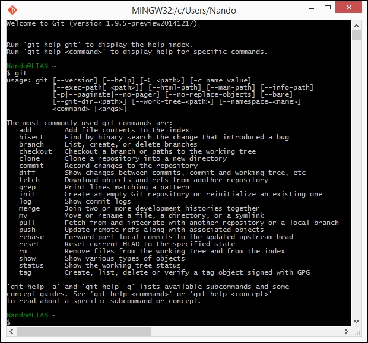
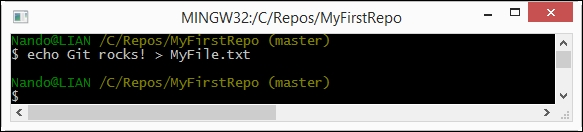
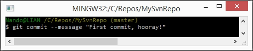

Lab: Getting Started with Collaboration
---------------------------------------

Running our first Git command
-----------------------------

Open a prompt and simply type `git` (or the equivalent, `git --help`), as shown in the following screenshot:





So, we have Git up and running!

### Setting up a new repository

The first step is to set up a new repository (or
repo, for short). A [**repo**]  is a
container for your entire project; every file or subfolder within it
belongs to that repository, in a consistent manner. Physically, a
repository is nothing other than a folder that contains a special
`.git` folder, the folder where the magic happens.

Let\'s try to make our first repo. Choose a folder you like, and type
the `git init` command, as shown here:


```
cd ~/work
mkdir MyFirstRepo
cd MyFirstRepo
git init
```

Now that we have a repo, we can start to put files
inside it. Git can trace the history of any gender of files, text based
or binary, small or large, with the same efficiency (more or less, large
files are always a problem).

### Adding a file

Let\'s create a text file just to give it a try.





We want `MyFile.txt` under the control
of Git, so let\'s add it, as shown here:


The `git add` command tells Git that we want it to take care
of that file and check it for future modifications.

Has Git obeyed us? Let\'s see.

Using the `git status` command, we can check the status of the
repo, as shown in the following screenshot:


As we can see, Git has accomplished its work as
expected. In this image, we can read words such as `branch`,
`master`, `commit` and `unstage`. We will
look at them briefly, but for the moment, let\'s ignore them.

### Commit the added file

At this point, Git knows about
`MyFile.txt`, but we have to perform another step to fix the
snapshot of its content. We have to commit it using the appropriate
`git commit` command. This time, we will add some flavor to
our command, using the `--message` (or `-m`)
subcommand, as shown here:





Press the [*Enter*] key.


With the commit of `MyFile.txt`, we have finally fired up our
repo. It now has a `master` branch with a file within it.