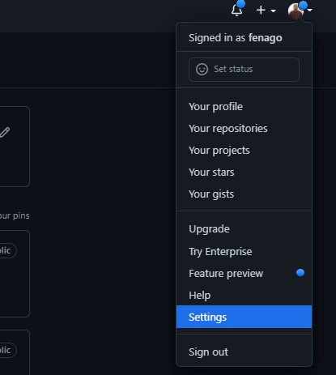
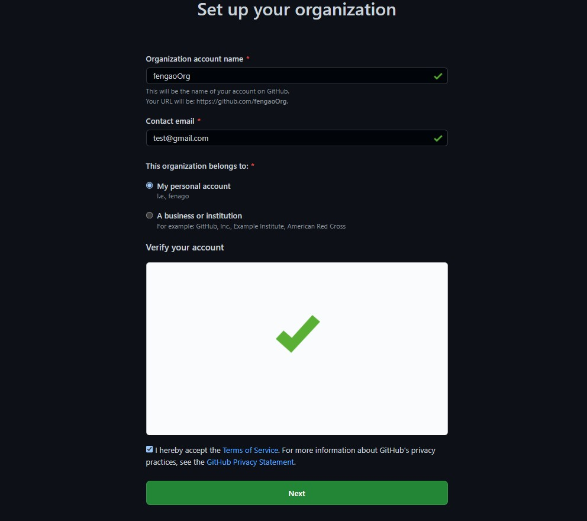
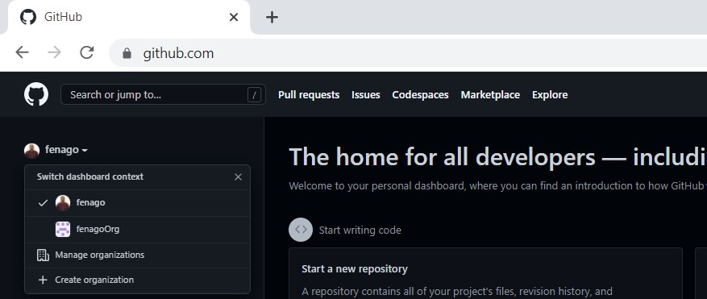
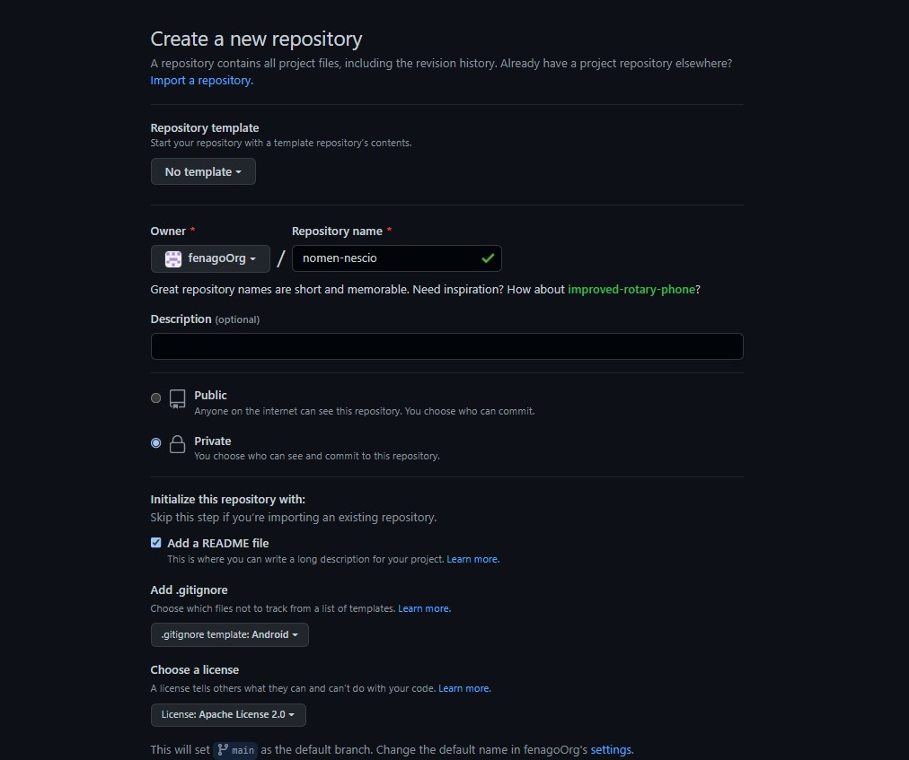

# Lab: GitHub Organization
In this lab, we will cover the following recipes:

- Setting up an organization at GitHub
- Creating a repository at GitHub
- Adding templates for issues and pull requests

#### Introduction
It is possible to host your own Git installation and maintain a central server for your organization. If you are a small company or an open source project, maintaining such an infrastructure can be a burden. But today, there exists a number of Git providers who can lift the burden.

GitHub is the best-known Git provider with 40 million users. Many high-profiled open source projects are hosted by GitHub. Once you have created an account at GitHub, you can explore the 85 million Git repositories currently hosted.

#### Pre-reqs:
- Google Chrome (Recommended)

#### Lab Environment
There is no requirement for any setup.

**Important:** Instructions for this lab are written in such a way that it also shows expected output from the git cli. Only run commands that start with **$** as shown below.


Setting up an organization at GitHub
------------------------------------

Whether you have a commercial product or an open source project, there
is likely a company or a group of people behind it. GitHub supports such
a structure by allowing users to create an organization.

An organization can have repositories associated and it has members. The
advantage of using an organization is that members might come and go
(developers will get a new job, and leave), but the repositories will be
associated with the organization so there will be no need to transfer
ownership of repositories.

As a user, you can be a member of multiple organizations. It is common
to be a member of your employer's organization but also of a number of
organizations behind open source projects.

### Getting ready

You will need a user account at GitHub. For this recipe, we will use the
GitHub user `fenago` . Any user can create an
organization. 

If you don't have a GitHub account, it is time to create one. Once you
have created your account and signed in, you are ready to go.

Signup: https://github.com/join


### How to do it...

1.  Creating an organization is a function under **`Settings`**. So, you
    need to find **`Settings`** in your GitHub account, as shown in the
    following screenshot:



2.  One menu item in **`Settings`** is **`Organizations`**. You can
    create an organization in two different ways. You can either turn
    your user into an organization or create a separate organization. We
    will create an organization and not turn the user into an
    organization, as shown in the next screenshot:


Click `Create Free Organization` button:





3.  Once the organization is created, you can invite users to become
    members. It is also possible to add outside or external
    collaborators. 

### How it works...

Organizations at GitHub are a layer on top of Git. They can be seen as a
way to provide access control to associated repositories.

When GitHub users explore the repositories associated with your
organizations, they will be subject to the privileges you have set up.
This means that you are in charge of what you allow others to see.

If you are a paying customer at GitHub, your organization can have
private repositories. A private repository is only accessible by members
of the organization. A company can have open source projects or examples
as public repositories. But, by using a private repository, it is
possible to have some company secrets.

### There's more...

Each organization has a number of settings that you can tweak. In order
to increase the security of your organization, you can require that
members have to use two-factor authentication.

You also have access to an audit log for your organization. In many
cases, you will have to ensure who did what. The audit log can also
reveal if someone has gained access to your organization and tried to
tamper with it.


Creating a repository at GitHub
-------------------------------

Using Git is all about repositories. GitHub provides a UI for creating
repositories. The UI makes it easier for new Git users to get started.
And for obvious reasons, GitHub does not give you access to their server
directly.

In the previous recipe, we created an organization at GitHub. In this
recipe, we will create a repository within the organization. As an
individual user (not an organization), you can create repositories too.

### Getting ready

You begin by logging in at GitHub. Before creating the repository, you
have to make two decisions. First, what should the repository's name be?
Second, should the repository be public or private?

Private repositories are only visible for members of the organization.
But in order to create private repositories, you must be a paying
customer.

### How to do it...

1.  Since we are going to create a repository for the organization, you
    will have to switch from your ordinary user to your organization.
    It's a dropdown with the title **`Switch dashboard context`**. Once
    you have switched context, your screen will look like this:



2.  Now, you are ready to create the repository. You will have to set
    the name, a **`Description (optional)`**, and decide whether the
    repository is **`Public`** or **`Private`**. Moreover, GitHub can
    create `.gitignore`, `LICENSE`, and a simple
    `README.md` for you. Often you will know the main
    programming language, and a `.gitignore` based on best
    practices can be generated. In the following screenshot, you can see
    all the fields with values:




3.  Once the repository is created, you can clone it on your computer as
    follows:

```
$ git clone https://github.com/fenagoOrg/nomen-nescio.git
$ cd nomen-nescio
$ ls -a

.          ..         .git       .gitignore LICENSE    README.md
```

### How it works...

The screens you went through in the recipe are *Creating a repository at
GitHub* server. In essence, it is simply creating a directory and
running `git init` .

Adding the extra files (`.gitignore`, `LICENSE`, and
`README.md`) is fairly simple too. Setting up a good
`.gitignore` takes time, but you get a good starting point
with the generated one.

GitHub also sets up access control for your repository. Only members of
the organization have write permissions; that is, they have the rights
to commit. In the settings of the repository, you can define more
precise access control under the menu item **`Collaborators & teams`**.
A team is a group of GitHub users who work together. In your company,
you might have iOS, Android, and DevOps teams.

### There's more...

With a repository at GitHub, code reviews are an integral part of pull
requests. Let's update `README.md` and perform a code review
at GitHub:

```
$ git checkout -b update-readme
Switched to a new branch 'update-readme'
$ echo "\nSoon a better name will be decided." >> README.md
$ git add README.md
$ git commit -m "Updating README.md"
[update-readme 6829c33] Updating README.md
1 file changed, 1 insertion(+)
$ git push origin update-readme
Counting objects: 3, done.
Delta compression using up to 4 threads.
Compressing objects: 100% (3/3), done.
Writing objects: 100% (3/3), 330 bytes | 330.00 KiB/s, done.
Total 3 (delta 1), reused 0 (delta 0)
remote: Resolving deltas: 100% (1/1), completed with 1 local object.
To https://github.com/fenagoOrg/nomen-nescio.git
 * [new branch] update-readme -> update-readme
```

You can now go to GitHub, find your repository and create a pull
request. You can invite your collaborators to review your changes before
they are merged, as shown in the following screenshot:


When we created the repository, we had the option to create it as a
private one. Private repositories are only available for paying
customers. From a Git perspective, there is no difference between public
and private repositories. The major difference is who can view a
repository. As you might imagine, public repositories can be viewed by
everybody. You don't even have to log in to GitHub to view a public
repository. These repositories are ideal for open source projects—and if
you read GitHub's terms closely, you will see that a public repository
is meant to be open source.

Private repositories can only be viewed by the users you have given
access to. Typically, every member of your organization can view private
repositories. In other words, private repositories are ideal for
internal projects or proprietary software. Today, many companies are
mixing public and private repositories while their software developers
can fluently move between repositories. 

Adding templates for issues and pull requests
---------------------------------------------

A commit template helps the
developer to include the relevant information in the commit message. At
GitHub, users will create issues and pull requests. It is up to the
issue or pull request creator to write a meaningful description.

This recipe will explain to you how to add templates for issues and pull
requests. The purpose is to help people to remember to include enough
context for you to quickly understand what the issue or pull request is
about.

### Getting ready

We will continue to use the repository `nomen-rescio`  that we
created in a previous recipe. GitHub is using **Markdown** as a markup
language everywhere. Markdown is developer friendly since it is plain
text with some special conversions for typesetting bold, bullet lists,
and so on. Going through Markdown might be a complete book on its own.

 

### How to do it...

1.  To start, you will need to find **`Settings`** for your repository.
    There is a big **`Set up templates`** button which is what you are
    looking for. You can choose to use one of the precanned templates,
    but we will create a custom one, as shown in the next screenshot:


2.  You save the template by clicking on **`Commit changes`**. When a
    user is creating an issue, your template will be shown. The user can
    choose to delete all your text but most users will read it before
    doing so; note the following screenshot:


 

 

### How it works...

Your templates live in the repository itself. Actually, you find them in
the directory `.github` . If you prefer, you can edit a
template in your favorite editor and commit changes just like any other
file.

The directory `ISSUE_TEMPLATE` contains the templates for
issues is the file. Similar, if you create a file under the directory
`PULL_REQUEST_TEMPLATE`, you will have a template for pull
requests. With multiple templates, the user will be asked to choose
which template is appropriate. 


