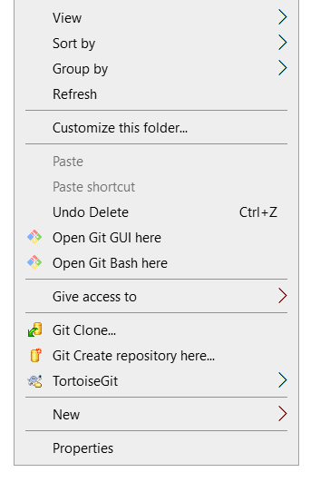
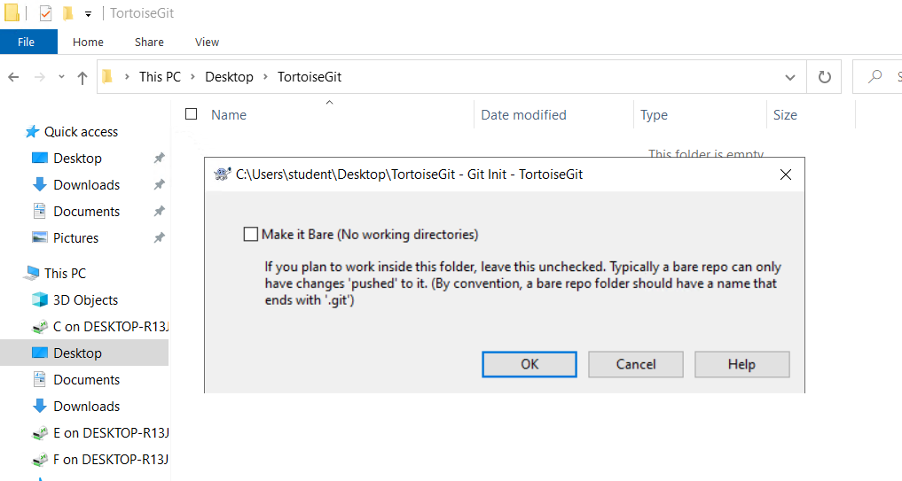
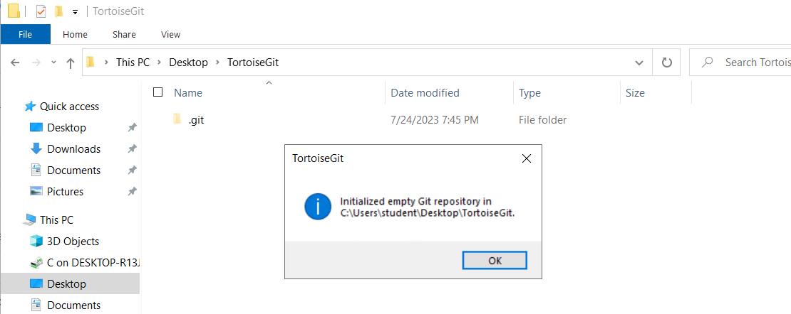
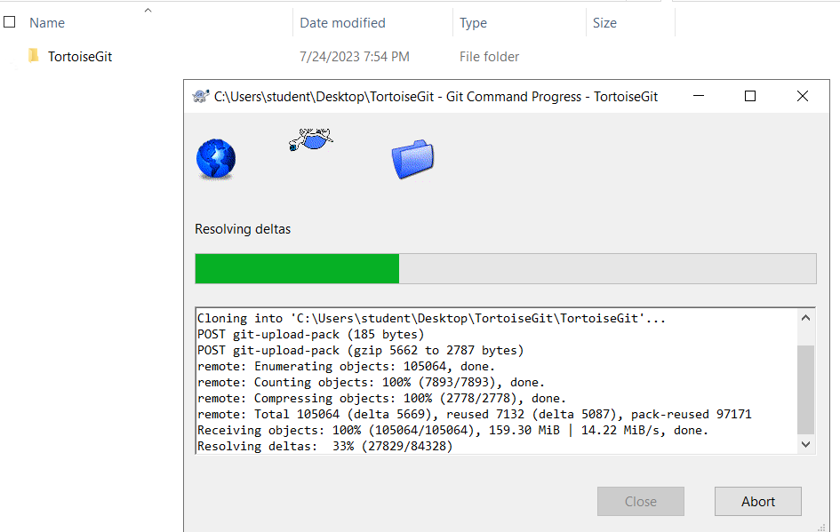
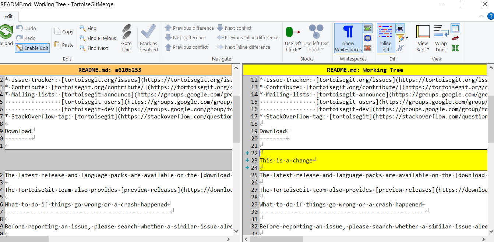
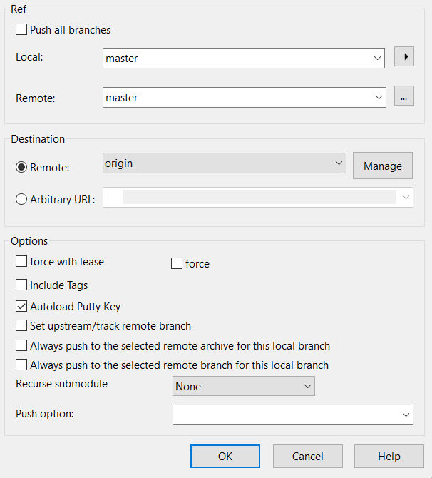

## Lab: Create, Clone Repository and Push changes using TortoiseGit

### Create Repository

Creating an empty git repository is very simple. 

1. Create new directory `TortoiseGit` on the Desktop.
2. In the `TortoiseGit` directory, just use the explorer context menu and select `Git Create Repository here`.

You can choose here between a bare and normal git repository. A normal repository has a working tree attached to which files can be checkout out and committed whereas a bare repository only can be pushed to and pulled from. After a (non bare) repository is created a message box will be shown:

**Note:** Make sure to delete `.git` directory before starting new task.

### Clone Repository

In this task, we will look how to clone a git repository from an existing repository. This operation is used to get a full copy of a remote repository. Cloning a git repository is very simple. At an empty directory, just use the explorer context menu and select `Git Clone ...` 

`https://github.com/TortoiseGit/TortoiseGit.git`

The Clone Dialog will show.

`URL`: Input repository URL address, which you will clone from. You can click **Browse** to browse directory.

`Directory`: Input your local directory, which you will clone to. You can click **Browse** to browse directory.

`Clone` will checkout current HEAD to work space automatically.

Click **OK** to start cloning the repo.

### Checking Out A Working Tree (Switch to commit)

The Switch/Checkout dialog can be used to checkout a specific version to the working tree (i.e., all files are updated to match their state of the selected version). Normally, a specific version will be represented by a (local) branch which is set as the current branch.

Select a git repository directory : `Desktop\TortoiseGit\TortoiseGit` in windows explorer. Right click to pop up the context menu and select the command `TortoiseGit` → `Switch/Checkout...`, which brings up the following dialog box:

If you enter a branch name at **Create New Branch**, a new branch will be created. Also, the new branch will be set as the current branch (HEAD).

You can click on the `...` to browse the references/branches/log to choose a branch to checkout.

When you selected a remote branch, you can check Track in order to track the remote branch. When you open the push, pull or sync dialog, the remote branch will be pre-selected automatically.

### Committing Your Changes To The Repository

Storing the changes you made to your working tree is known as committing the changes. you can use TortoiseGit → Check for Modifications first, to see which files have changed locally.

**Task:** Make any change in `README.md` in the notepad++ editor and save the changes.

**The Commit Dialog**

If there are no conflicts, you are ready to commit your changes. Select any file and/or folders you want to commit, then `TortoiseGit` → `Commit....`

The commit dialog will show you every changed file, including added, deleted and unversioned files. If you don't want a changed file to be committed, just uncheck that file. If you want to include an unversioned file, just check that file to add it to the commit.

**Double clicking** on any modified file in the commit dialog will launch the external diff tool to show your changes. The context menu will give you more options, as shown in the screenshot. You can also drag files from here into another application such as a text editor or an IDE.

#### Commit Log Messages

You can apply simple formatting to your log messages using a convention similar to that used within emails. To apply styling to text, use *text* for bold, _text_ for underlining, and ^text^ for italics.

**Commit Progress**

After pressing `Commit`, a dialog appears displaying the progress of the commit.

### Pull and Fetch change

In this task, we will look how to fetch or pull (i.e., download) changes from another repository. The difference between pull and fetch is:

Fetch just downloads the objects and refs from a remote repository and normally updates the remote tracking branches. Pull, however, will not only download the changes, but also merges them - it is the combination of fetch and merge (cf. the section called “Merging”). The configured remote tracking branch is selected automatically.

A pull/fetch can be initiated by using `TortoiseGit` → `Pull...` or `TortoiseGit` → `Fetch....` Fetching and pulling changes is also possible using the Sync dialog (cf. the section called “Sync”), however, there you have less options, but the sync dialog allows you to initiate other operations such as pushing and to see diffs and changes.

The fetch and pull dialog will open.

**Sync**

The Sync Dialog provides an interface for all operations related with remote repositories in one dialog. This includes push, pull, fetch, remote update, submodule update, send patch... However, the sync dialog provides less options as the regarding dialogs.

The sync dialog can be opened using `Sync...`.

**Activity: Push Changes in GitHub**

1. Create a new repository on GitHub.
2. Clone the repository using **TortoiseGit**.
3. Make some changes in the repo and commit the changes.
4. In order to perform a push open the push dialog using `TortoiseGit` → `Push...`.

**Note:** You will have to login using `TortoiseGit` from GitHub first. Click `Sign in with your browser` and login.

