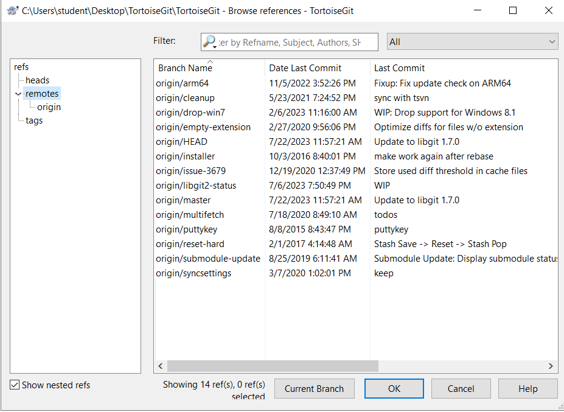
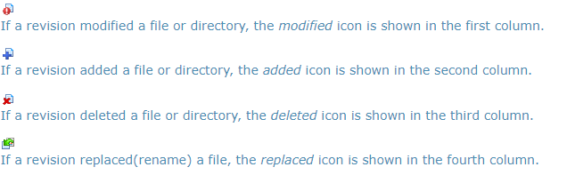

## Lab : Compare local changes to the repository

**Browse All Refs**

Reference browser, which allows you to view and work with all refs (tags, branches, remote branches, stash and so on). It can be opened using TortoiseGit → Browse Reference....

**Log Dialog**

For every change you make and commit, you should provide a log message for that change. That way you can later find out what changes you made and why, and you have a detailed log for your development process.

The Log Dialog retrieves all those log messages and shows them to you. 

Invoking the Revision Log Dialog

There are several places from where you can show the Log dialog:

- From the explorer context menu using `TortoiseGit` → `Show log....`
- From various TortoiseGit dialogs where you can select a commit (oftentimes using a ... button).
- From various TortoiseGit dialogs where commit entries or files are shown using the context menu.

**Revision Log Actions**

The top pane has an Actions column containing icons that summarize what has been done in that revision. There are four different icons, each shown in its own column.

**Revision Graphs**

Sometimes you need to know where branches and tags were taken from the point, and the ideal way to view this sort of information is as a graph or tree structure. That's when you need to use `TortoiseGit` → `Revision Graph...`

This command analyses the revision history and attempts to create a direct graph showing the points at tag, branch and other reference.

**Important**

In order to generate the graph, TortoiseGit must fetch all log messages from the repository root. Just show commits which have some reference point to.

**Using the Graph**

To make it easier to navigate a large graph, use the overview window. This shows the entire graph in a small window, with the currently displayed portion highlighted. You can drag the highlighted area to change the displayed region.

The revision date, author and comments are shown in a hint box whenever the mouse hovers over a revision box.

If you select two revisions (Use **Ctrl-left click**), you can use the context menu to show the differences between these revisions. You can choose to show differences as at the branch creation points, but usually you will want to show the differences at the branch end points, i.e. at the HEAD revision.

You can view the differences as a Unified-Diff file, which shows all differences in a single file with minimal context. If you opt to `Context Menu` → `Compare Revisions` you will be presented with a list of changed files. Double click on a file name to fetch both revisions of the file and compare them using the visual difference tool.

If you right click on a revision you can use `Context Menu` → `Show Log` to view the history.

**Refreshing the View**

If you want to check the server again for newer information, you can simply refresh the view using F5.

### Reference Log

The reference log (RefLog) displays the history of a reference (i.e., it is displayed to which commits it pointed in the past). In can be opened using `TortoiseGit` → `RefLog`, however, you have to hold the Shift key while right clicking on on a folder in the explorer in order to see this, because it is in the extended context menu by default.

The RefLog can be used to restore deleted commits or HEAD positions (e.g. when you deleted a branch which was HEAD some time ago).

### The Repository Browser

Sometimes you need to see all contents/files of a repository, without having a working tree (e.g. a bare repository) or you want to see all files of a revision without switching to it. That's what the Repository Browser is for. You can open it using `TortoiseGit` → `Repo-browser` or from the log dialog (cf. the section called “Log Dialog”) using the context menu of a commit.

The repository browser looks very similar to the Windows explorer, except that it is showing the content of the repository at a particular revision rather than files on your computer. In the left pane you can see a directory tree, and in the right pane are the contents of the selected directory. At the top of the Repository Browser Window you can see the path within the repository and the revision you want to browse.

Just like Windows explorer, you can click on the column headings in the right pane if you want to set the sort order. And as in explorer there are context menus available in both panes.

In order to get an older version of a file you can click on a file and select `Save revision to`, but it is also possible to just drag one or more files into a Windows explorer window.

The context menu for a file allows you to:

1. Open the selected file, either with the default viewer for that file type, or with a program you choose.
2. Show the revision log for that file so you can see the history of it.
3. Compare the file at the selected revision with the same file in your working tree.
4. Blame the file, to see who changed which line and when.
5. Save an unversioned copy of the file to your hard drive or revert this file in your working copy (i.e. saves the file to it's old path in the working tree).
6. Copy the filename with full path shown in the address bar to the clipboard.

The context menu for a folder allows you to:

1. Show the revision log for that folder.
2. Copy the full path to the clipboard.

### Adding New Files

1. Create new text file, write some text and save it.

2. You need to add them to new files to source control. Select the file(s) and/or NOT empty directory and use `TortoiseGit` → `Add`.

If you add a file by mistake, you can undo the addition before you commit using `TortoiseGit` → `Delete (keep local)...` or `Revert`.

### Undo Changes

If you want to undo all changes you made in a file since your last commit you need to select the file, right click to pop up the context menu and then select the command `TortoiseGit` → `Revert`. A dialog will pop up showing you the files that you've changed and can revert. Select those you want to revert and click on OK.

If you want to undo a deletion or a rename, you need to use Revert on the parent folder (or commit or repository status dialog) as the deleted item does not exist for you to right-click on.

If you want to undo the addition of an item, this appears in the context menu as `TortoiseGit` → `Delete (keep local)`. This is really a revert as well, but the name has been changed to make it more obvious.

### Stash Changes

Stashing takes the dirty state of your working directory — that is, your modified tracked files and staged changes — and saves it on a stack of unfinished changes that you can reapply at any time (even on a different branch).

When you want to record the current state of the working directory and the index, but want to go back to a clean working directory, right click on a folder to pop up the context menu and then select the command `TortoiseGit` → `Stash` changes A dialog will pop up where you can optionally enter a message for this state:

**Note:** Create new/modify few files before clicking `Stash`.

You can also select `include untracked`, to stash untracked files away, too. To stash all files away, including ignored files in addition to the untracked files, select `--all`.

When TortoiseGit detects that a stashed changes exist, the context menu will be extended:

The stash is implemented as a stack. `Stash Apply` will apply the changes of the latest stash to your working tree. `Stash Pop` does the same, but will remove the latest stash from the stack after applying it. `Stash changes` is still possible and will stash the current changes of the working copy to the top of the stack. Stash List provides an overview of all the whole stash stack. You can also remove and view the stashed changes there (similarly to the the section called “Log Dialog” and the section called “Reference Log”).

