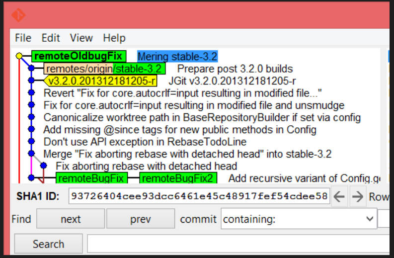

# Lab: Working Locally and Branching with Git

In this lab, we will cover the following recipes:

- Managing your local branches
- Branches with remotes
- Forcing a merge commit
- Orphan branches

#### Introduction
If you are developing a small application in a big corporation as a developer, or you are trying to wrap your head around an open source project from GitHub, you have already been using branches with Git.

Most of the time, you may have just been working on a local development or master branch, and so didn't care so much about other branches.

In this lab, we will show you different branch types and how to work with them.

#### Pre-reqs:
- Google Chrome (Recommended)

#### Lab Environment
There is no requirement for any setup.

**Important:** Instructions for this lab are written in such a way that it also shows expected output from the git cli. Only run commands that start with **$** as shown below.


Managing your local branches
----------------------------

Suppose you just have your local Git repository, and, at the moment, you
have no intention of sharing the code with others; you can, however,
easily share the knowledge you have while working with a repository with
one or more remotes. Local branches with no remotes work exactly in this
fashion. As you can see in the examples, we are cloning a repository,
and thus we have a remote.

Let's start by creating a few local branches.

### Getting ready

Use the following command to clone the `jgit` repository to
match:

```
$ git clone https://git.eclipse.org/r/jgit/jgit 
$ cd jgit 
```

### How to do it...

Perform the following steps to manage your local branches:

1.  Whenever you start working on a bug fix or a new feature in your
    project, you should create a branch. You can do so using the
    following code:

```
$ git branch newBugFix 
$ git branch 
* master 
 newBugFix
```

2.  The `newBugFix` branch points to the current
    `HEAD` you were on at the time of the creation. You can
    see the `HEAD` with `git log -1`:

```
$ git log -1 newBugFix --format=format:%H 
25fe20b2dbb20cac8aa43c5ad64494ef8ea64ffc
```

3.  If you want to add a description to the branch, you can do this with
    the `--edit-description` option for the git branch
    command:

```
$ git branch --edit-description newBugFix
```

4.  The previous command will open an editor where you can type in a
    description:

```
Refactoring the Hydro controller 

The hydro controller code is currently horrible needs to be refactored.  
```

5.  Press `i` to get into insert mode in Vim. To save and exit press `esc` key then `:wq`. Close the editor and the message will be saved.

### How it works...

Git stores the information in the local `git config` file;
this also means that you cannot push this information to a remote
repository.

To retrieve the description for the branch, you can use the
`--get` flag for the `git config` command:

```
$ git config --get branch.newBugFix.description 

Refactoring the Hydro controller 

The hydro controller code is currently horrible and needs to be refactored.  
```

### Note

Remember to perform a checkout of `newBugFix` before you start
working on it. This must be done with the Git checkout of
`newBugFix`. If you are in a hurry, you can create and
checkout a new branch in a single command. Just give the option
`-b` to `checkout`.

The branch information is stored as a file in
`.git/refs/heads/newBugFix` 

```
$ cat .git/refs/heads/newBugFix 
25fe20b2dbb20cac8aa43c5ad64494ef8ea64ffc 
```

Note that it is the same commit hash we retrieved with the
`git log` command.

### There's more...

Perhaps you want to create specific branches from specific commit
hashes. The first thought might be to check out the commit, and then
create a branch; however, it is much easier to use the
`git branch` command to create the branches without checking
out the commits:

1.  If you need a branch from a specific commit hash, you can create it
    with the `git branch` command as follows:

```
$ git branch anotherBugFix 979e346 
$ git log -1 anotherBugFix --format=format:%h 
979e346 

$ git log -1 anotherBugFix --format=format:%H 
979e3467112618cc787e161097986212eaaa4533 
```

2.  As you can see, the abbreviated commit hash is shown when you use
    `%h`, and the full commit hash is shown when you use
    `%H`. You can see that the abbreviated commit hash is the
    same as the one used to create the branch. Most of the time, you
    want to create and start working on the branch immediately:

```
$ git checkout -b lastBugFix 979e346 
Switched to a new branch 'lastBugFix' 
```

3.  Git switches to the new branch immediately after it creates the
    branch. The
    `lastBugFix` branch is checked out and another
    `BugFix` branch is at the same commit hash:


4.  You can add `-v` to the `git branch` command

```
$ git branch -v 

  anotherBugFix 979e346 Interactive Rebase: Do actions if  
* lastBugFix    979e346 Interactive Rebase: Do actions if  
  master        25fe20b Add missing package import for jg 
  newBugFix     25fe20b Add missing package import for jg
```

5.  With `-v`, you can see the abbreviated commit hash for
    each branch, and with `-vv`, you can also see that the
    master branch tracks the origin/master branch:

```
$ git branch -vv 

  anotherBugFix 979e346 Interactive Rebase: Do actions if e 
* lastBugFix    979e346 Interactive Rebase: Do actions if e 
  master        25fe20b [origin/master] Add missing package  
  newBugFix     25fe20b Add missing package import for g 
```

Branches with remotes
---------------------

* * * * *

At some point, it is very likely that you have cloned somebody's
repository. This means that you have an associated remote. The remote is
usually called origin because it is where the source originated from.

While working with Git and remotes, you will get some benefits from Git.

We can start with git status and see what we get while working with the
remote.

### Getting ready

Follow these steps:

1.  We will start by checking out a local branch that tracks a remote
    branch:

```
$ git checkout -b remoteBugFix --track origin/stable-3.2 
Branch remoteBugFix set up to track remote branch stable-3.2 from origin. 
Switched to a new branch 'remoteBugFix'
```

2.  The previous command creates and checks out the
    `remoteBugFix` branch that will track the
    `origin/stable-3.2` branch. Therefore, for instance,
    executing `git status` will automatically show how
    different your branch is from `origin/stable-3.2`, and it
    will also show whether your branch's `HEAD` can be fast
    forwarded to the `HEAD` of the remote branch or not.
3.  To provide an example of how the previous step works, we need to do
    some manual work that will simulate this situation. First, we find a
    commit:

```
$ git log -10 origin/stable-3.2 --oneline 
f839d383e (HEAD -> remoteBugFix, origin/stable-3.2) Prepare post 3.2.0 builds
699900c30 (tag: v3.2.0.201312181205-r) JGit v3.2.0.201312181205-r
0ff691cdb Revert "Fix for core.autocrlf=input resulting in modified file..."
1def0a125 Fix for core.autocrlf=input resulting in modified file and unsmudge
0ce61caef Canonicalize worktree path in BaseRepositoryBuilder if set via config
be7942f2b Add missing @since tags for new public methods in Config
ea04d2329 Don't use API exception in RebaseTodoLine
3a063a0ed Merge "Fix aborting rebase with detached head" into stable-3.2
e90438c0e Fix aborting rebase with detached head
2e0d17885 Add recursive variant of Config.getNames() methods 
```

4.  The command will list the last 10 commits on the
    `stable-3.2` branch from the remote origin. The
    `--oneline` option will show the abbreviated commit hash
    and the commit subject. For this recipe, we will be using the
    following commit:

```
$ git reset --hard 2e0d178 
HEAD is now at 2e0d178 Add recursive variant of Config.getNames() methods 
```

5.  This will reset the `remoteBugFix` branch to the
    `2e0d178` commit hash. We are now ready to continue using
    the free benefits of Git when we have a remote tracking branch.

We are resetting to a commit that is accessible from the
`origin/stable-3.2` remote tracking branch; this is done to
simulate that we have performed a Git fetch and new commits were
downloaded for the`origin/stable-3.2` branch.

### How to do it...

Here, we will try a few commands that assist you when you have a remote
tracking branch:

1.  Start by executing `git status` :

```
$ git status 

On branch remoteBugFix 
Your branch is behind 'origin/stable-3.2' by 9 commits, and can be fast-forwarded. 
  (use "git pull" to update your local branch) 

  nothing to commit, working directory clean 
```

Git is very descriptive when you have a tracking branch and you use
`git status` .

As you can see from the message, you can use`git pull` to
update your local branch, which we will try in the next example. The
message says it can be fast-forwarded. It simply means that Git can
advance the `HEAD` without merging. Now, we will just perform
the merge:

### Note

The`git pull` command is just a`git fetch` command and
then a`git merge` command with the remote tracking branch.

```
$ git merge origin/stable-3.2 

Updating 2e0d178..f839d38 
Fast-forward 
 .../org/eclipse/jgit/api/RebaseCommandTest.java    | 213 +++++++++++ 
 .../src/org/eclipse/jgit/api/RebaseCommand.java    |  31 +-- 
 .../jgit/errors/IllegalTodoFileModification.java   |  59 ++++++ 
 .../eclipse/jgit/lib/BaseRepositoryBuilder.java    |   2 +- 
 .../src/org/eclipse/jgit/lib/Config.java           |   2 +
 .../src/org/eclipse/jgit/lib/RebaseTodoLine.java   |  16 +- 
 6 files changed, 266 insertions(+), 57 deletions(-) 
 create mode 100644 org.eclipse.jgit/src/org/eclipse/jgit/errors/IllegalTodoFileModification.java
```

2.  From the output, you can see it is a fast-forward merge, as Git
    predicted in the output of `git status` .

### There's more...

You can also add a remote to an existing branch, which is very handy
when you realize that you actually wanted a remote tracking branch but
forgot to add the tracking information while creating the branch:

1.  Start by creating a local branch at the `2e0d17` commit:

```
$ git checkout -b remoteBugFix2 2e0d17 
Switched to a new branch 'remoteBugFix2' 
```

2.  The `remoteBugFix2` branch is just a local branch at the
    moment with no tracking information; to set the tracking branch, we
    need to use `--set-upstream-to`   or `-u` as a
    flag to the `git branch` command:

```
$ git branch --set-upstream-to origin/stable-3.2 
Branch remoteBugFix2 set up to track remote branch stable-3.2 from origin. 
```

3.  As you can see from the Git output, we are now tracking the
    `stable-3.2` branch from the origin:

```
$ git status 
On branch remoteBugFix2 
Your branch is behind 'origin/stable-3.2' by 9 commits, and can be fast-forwarded. 
  (use "git pull" to update your local branch) 
nothing to commit, working directory clean 
```

4.  You can see from the Git output that you are nine commits ahead, and
    you can use `git pull` to update the branch. Remember that
    a `git pull` command is just a `git fetch` 
    command, followed by a `git merge` command with the
    upstream branch, which we also call the remote tracking branch:

```
$ git pull 

Updating 2e0d17885..f839d383e
Fast-forward
 org.eclipse.jgit.test/tst/org/eclipse/jgit/api/RebaseCommandTest.java | 213 +++++++++++++++++++++++++++++++++++++++++++++++++++++++++++++++++++++++++++++++----------------
 org.eclipse.jgit/src/org/eclipse/jgit/api/RebaseCommand.java | 31 ++++++++------
 org.eclipse.jgit/src/org/eclipse/jgit/errors/IllegalTodoFileModification.java | 59 +++++++++++++++++++++++++++
 org.eclipse.jgit/src/org/eclipse/jgit/lib/BaseRepositoryBuilder.java | 2 +-
 org.eclipse.jgit/src/org/eclipse/jgit/lib/Config.java | 2 +
 org.eclipse.jgit/src/org/eclipse/jgit/lib/RebaseTodoLine.java | 16 ++++----
 6 files changed, 266 insertions(+), 57 deletions(-)
 create mode 100644 org.eclipse.jgit/src/org/eclipse/jgit/errors/IllegalTodoFileModification.java
```

5.  From the output, you can see that the branch has been fast forwarded
    to the `f839d383e`  commit hash, which is equivalent to
    `origin/stable-3.2` . You can verify this with
    `git log` :

```
$ git log -1 origin/stable-3.2  --format=format:%h 
f839d383e 
```


Forcing a merge commit
----------------------

* * * * *

You might have seen a lot of basic examples of software delivery chains
and branching models before reading this book. It is very likely that
you have been trying to use different strategies and found that none of
them completely support your scenario, which is perfectly fine as long
as the tool can support your specific workflow.

Git supports almost any workflow. We have often encountered a situation
that requires a merge commit while merging a feature, even though it can
be done with a fast-forward merge. Those who requested it often use it
to indicate that you have actually merged in a feature and want to store
the information in the repository.

### Note

Git has fast and easy access to all the commit messages, so the
repository should be used as a journal, and not just a backup of the
source code.

### Getting ready

Start by checking out a local branch `remoteOldbugFix` that
tracks `origin/stable-3.1` :

```
$ git checkout -b remoteOldBugFix --track origin/stable-3.1 
Branch remoteOldBugFix set up to track remote branch stable-3.1 from Switched to a new branch 'remoteOldBugFix' 
```

### How to do it...

The following steps will show you how to force a merge commit:

1.  To force a merge commit, you need to use the `--no-ff` 
    flag; *no-ff* means no fast forward. We will also use
    the `--quiet`  flag to minimize the output and
    `--edit` to allow us to edit the commit message. Unless
    you have a merge conflict, Git will create the merge commit for you
    automatically:

```
$ git merge origin/stable-3.2 --no-ff --edit --quiet 

Auto-merging org.eclipse.jgit.test/tst/org/eclipse/jgit/test/resources/SampleDat 
Removing org.eclipse.jgit.test/tst/org/eclipse/jgit/internal/storage/file/GCTe 
Auto-merging org.eclipse.jgit.packaging/org.eclipse.jgit.target/jgit-4.3.target 
```

2.  The commit message editor will open, and you can write a commit
    message. Closing the editor creates the merge commit and we are
    done.

3.  To verify this, you can reset back to
    `origin/stable-3.1` and perform the merge without
    the`--no-ff` flag:

```
$ git reset --hard  remotes/origin/stable-3.1 
HEAD is now at da6e87b Prepare post 3.1.0 builds 
```

4.  Now, perform the merge with the following command:

```
$ git merge origin/stable-3.2 --quiet
```

5.  You can see the difference. The following screenshot
    shows the fast- forward merge; as you can see, our
    `remoteOldBugFix` branch points to
    `origin/stable-3.2` :


6.  The next screenshot shows the merge commit we forced Git to create.
    Our branch`remoteOldBugFix` is ahead of
    `remotes/origin/stable-3.2`, and then we performed the
    commit:




Orphan branches
---------------

You are now familiar with Git's data model, the DAG. You have seen that
objects have a parent. When you create a new branch, the commit is its
parent. However, in some situations, it is useful to have a branch with
no parent.

One example would be an instance where you have your code base in two
separate repositories, but, for some reason, you now want to consolidate
it into one. One way is to simply copy the files and add them to one of
the repositories, but the disadvantage is that you will lose the
histories. The second way is to use an orphan branch that can help you
to fetch one repository in another.

### Getting ready

It is actually easy to create an orphan branch. The flag
`--orphan` to `checkout` will do it. It can be
executed as follows:

```
$ git clone https://github.com/fenago/github_helloworld.git
$ cd github_helloworld
$ git checkout --orphan fresh-start
Switched to a new branch 'fresh-start'
```

### How to do it...

1.  We now have a branch with no parent. You can verify it by examining
    the commit log as follows:

```
$ git log
fatal: your current branch 'fresh-start' does not have any commits yet
```

`Fresh start` does not mean that you are starting from
scratch. The files and directories that have been added to the
repository still exist:

```
$ ls
helloWorld.groovy hello_world.c hello_world.php hello_world.pl hello_world.py hello_world.sh

$ git status
On branch fresh-start

No commits yet

Changes to be committed:
 (use "git rm --cached <file>..." to unstage)

 new file: helloWorld.groovy
 new file: hello_world.c
 new file: hello_world.php
 new file: hello_world.pl
 new file: hello_world.py
 new file: hello_world.sh
```

2.  If you need a fresh start, you can delete the files (but remember
    not to delete `.git`) as follows:

```
$ git rm --cached README.md a_sub_directory/readme another-file.txt cat-me.txt hello_world.c
$ rm -rf README.md a_sub_directory another-file.txt cat-me.txt hello_world.c
$ git status
On branch fresh-start

No commits yet

nothing to commit (create/copy files and use "git add" to track)
```

3.  You have a branch with no files and no commits. Moreover, the branch
    does not share any commit history with your `master` 
    branch. You could add another repository and fetch all its commits
    using `git remote add` and `git fetch` . Instead,
    we will simply add a text file to illustrate it as follows:

```
$ echo "This is from an orphan branch." > orphan.txt
$ git add orphan.txt
$ git commit  -m "Orphan"
```

Commit is the only thing in the history that you can verify with the
command `git log` . If you fetch another repository into the
branch, you will see all the commits and, more importantly you will have
a copy of the repository's history. 

4.  Once you have your commits in place on the orphan branch, it is time
    to merge them into your master branch. However, your first attempt
    will fail. For example, check the following:

```
$ git checkout master
$ git merge fresh-start
fatal: refusing to merge unrelated histories
```

5.  As you can see, the orphan branch does not share history with the
    master branch, and git will not allow you to merge the branch. It
    shouldn't come as a surprise, since it is basically what an orphan
    branch is all about. However, you can still merge an orphan branch
    by allowing unrelated histories to be merged:

```
$ git merge fresh-start --allow-unrelated-histories
$ git log -3
commit aa804347c728552f7ce9298a83ab646148078dab (HEAD -> master)
Merge: 13dcada 45d1798
Author: John Doe <john.doe@example.com>
Date: Fri May 11 08:57:45 2018 +0200

Merge branch 'fresh-start'

commit 45d179838f8f9f8fd64c6c7bf96147e09ceadbc2 (fresh-start)
Author: John Doe <john.doe@example.com>
Date: Fri May 11 08:57:22 2018 +0200

Orphan

commit 13dcada077e446d3a05ea9cdbc8ecc261a94e42d (origin/master, origin/HEAD)
Author: John Doe <john.doe@example.com>
Date: Fri Dec 13 12:26:00 2013 +0100

This is the subject line of the commit message

... and more output
```

It is unlikely that you will use orphan branches on a daily basis, but
it is a strong feature to know when you need to reorganize your code
base.

### There's more...

There are more options in the help files for Git. Just run
`git merge --help` or `git branch --help` to see
what other options are available. 
