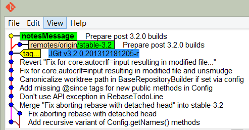

# Lab: Viewing Local Project History
In this lab, we will cover the following recipes:

- Adding your first Git note
- Separating notes by category

#### Tutorial Overview

Git is powerful in many ways. One of the most powerful features of Git is that it has immutable history. This is powerful because nobody can squeeze something into the history of Git without it being noticed by the people who have cloned the repository. This also causes some challenges for developers, as some would like to change the commit messages after a commit has been released. This is possible in many other version control systems, but because of the immutable history with Git, it has Git notes. A Git note is essentially an extra refs/notes/commits reference in Git. Here, you add additional information to the commits that can be displayed when running a git log command. You can also release the notes into a remote repository so that people can fetch the notes.


#### Pre-reqs:
- Google Chrome (Recommended)

#### Lab Environment
There is no requirement for any setup.

**Important:** Instructions for this lab are written in such a way that it also shows expected output from the git cli. Only run commands that start with **$** as shown below.


Adding your first Git note
--------------------------


We will add some extra information to the already released code. If we
were doing it in the actual commits, we would see the commit hashes
change.

### Getting ready

Before we start, we need a repository to work in; you can use the
previous clone of `jgit`, but to get an output from the
example that's almost identical, you can clone the `jgit` 
repository as follows:

```
$ git clone https://git.eclipse.org/r/jgit/jgit lab5
$ cd lab5 
```

### How to do it...

We start by creating a local branch, `notesMessage`, tracking
`origin/stable-3.2` . Then, we will try and change the commit
message and see that the commit hash changes:

1.  Checkout the branch `notesMessage` tracking
    `origin/stable-3.2` :

```
$ git checkout -b notesMessage  --track origin/stable-3.2
Branch notesMessage set up to track remote branch stable-3.2 from origin.
Switched to a new branch 'notesMessage'
```

2.  List the commit hash of the `HEAD` of your branch:

```
$ git log -1
commit f839d383e6fbbda26729db7fd57fc917fa47db44
Author: Matthias Sohn <matthias.sohn@sap.com>
Date:   Wed Dec 18 21:16:13 2013 +0100
    
    Prepare post 3.2.0 builds
    
    Change-Id: Ie2bfdee0c492e3d61d92acb04c5bef641f5f132f
    Signed-off-by: Matthias Sohn <matthias.sohn@sap.com>
```

3.  Change the commit message by amending the commit using
    `git commit --amend`, and, following that, add a line
    above the `Change-Id:` line with
    `Update MANIFEST files` :

```
$ git commit --amend
```

4.  Now, we list the commit again and see that the commit hash has
    changed:

```
$ git log -1
commit 5ccc9c90d29badb1bd860d29860715e0becd3d7b
Author: Matthias Sohn <matthias.sohn@sap.com>
Date:   Wed Dec 18 21:16:13 2013 +0100
    
    Prepare post 3.2.0 builds
    
    Update MANIFEST files

    Change-Id: Ie2bfdee0c492e3d61d92acb04c5bef641f5f132f
    Signed-off-by: Matthias Sohn matthias.sohn@sap.com
```

5.  Notice that the commit parts have changed from
    `f839d383e6fbbda26729db7fd57fc917fa47db44`  to `9fcaa153c4afc6ee95572a58ddfa297f60b7e1cf`,
    as the commit is derived from the content in the commit, the parents
    of the commit, and the commit message. So, the commit hash will
    change when updating the commit message. Since we have changed the
    content of the `HEAD` commit, we are no longer based on
    the `HEAD` commit of the `origin/stable-3.2` 
    branch. This becomes visible in `git status`:

```
$ git status
On branch notesMessage
Your branch and 'origin/stable-3.2' have diverged,
and have 1 and 1 different commit each, respectively.
(use "git pull" to merge the remote branch into yours)
    
nothing to commit, working directory clean
```

6.  As you can see from the output, our branch has diverged from
    `origin/stable-3.2` ; Let's see `origin/stable-3.2` and `HEAD` :

The following is the screenshot for this:



7.  To prevent this result, we can add a note to the commit message.
    Let's start by resetting the branch to `origin/stable-3.2` 
    and then adding a note to the commit:

```
$ git reset --hard origin/stable-3.2
HEAD is now at f839d38 Prepare post 3.2.0 builds
```

8.  Now, add the same message as the previous one, but just as a note:

```
$ git notes add -m "Update MANIFEST files"
```

9.  We have added the note directly from the command line without
    invoking the editor by using the `-m` flag and then a
    message. The log will now be visible when running
    `git log` :

```
$ git log -1
    
commit f839d383e6fbbda26729db7fd57fc917fa47db44
Author: Matthias Sohn <matthias.sohn@sap.com>
Date:   Wed Dec 18 21:16:13 2013 +0100
    
    Prepare post 3.2.0 builds
    
    Change-Id: Ie2bfdee0c492e3d61d92acb04c5bef641f5f132f
    Signed-off-by: Matthias Sohn <matthias.sohn@sap.com>
    
Notes:
    Update MANIFEST files
```

10. As you can see from the log output, we have a `Notes:` 
    section with our note. Although it does not add the note directly in
    the commit message as the `--amend` option does, we still
    have our important addition to the commit message. We can verify
    with `git status` that we have no longer diverged:

```
$ git status
On branch notesMessage
Your branch is up-to-date with 'origin/stable-3.2'.
    
nothing to commit, working directory clean
```

### There's more...

So, you have your notes for your commit and now you want to add to them.
You will perhaps expect that you just add the note again with more
information. This is not the case. You have the option to append, edit,
or force the note to be created:

1.  Start by trying to add the note again with additional information:

```
$ git notes add -m "Update MANIFESTS files for next version"
error: Cannot add notes. Found existing notes for object f839d383e6fbbda26729db7
fd57fc917fa47db44. Use '-f' to overwrite existing notes
```

2.  As predicted, we cannot add the note but we can do it with the
    `-f` flag:

```
$ git notes add -f -m "Update MANIFESTS files for next version"
Overwriting existing notes for object f839d383e6fbbda26729db7fd57fc917fa47db44
```

3.  Git overwrites the existing notes due to the `-f` flag.
    You can also use `--force`, which is the same. Verify it
    with `git log` :

```
$ git log -1
commit f839d383e6fbbda26729db7fd57fc917fa47db44
Author: Matthias Sohn <matthias.sohn@sap.com>
Date:   Wed Dec 18 21:16:13 2013 +0100
    
    Prepare post 3.2.0 builds
    
    Change-Id: Ie2bfdee0c492e3d61d92acb04c5bef641f5f132f
    Signed-off-by: Matthias Sohn <matthias.sohn@sap.com>
    
Notes:
   Update MANIFESTS files for next version
```

4.  You can also append a current note with
    `git notes append` :

```
$ git notes append -m "Verified by John Doe"
```

5.  There is no output from this unless something goes wrong, but you
    can verify this by using `git log` again. To keep the
    output to a minimum, we are using `--oneline` . This will
    show a minimum output of the commit. But to show the note, we have
    to add `--notes`, which will show the notes for the
    commits in the output:

```
$ git log -1 --notes --oneline
f839d38 Prepare post 3.2.0 builds
Notes:
    Update MANIFESTS files for next version
    
    Verified by John Doe
```

6.  As we can see from the output, we have the line appended to the
    note. If you try to use the `edit` option, you will see
    that you can only use this with the `-m` flag. This makes
    good sense, as you should edit the note and not overwrite or append
    an already created note:

```
$ git notes edit -m "John Doe"
The -m/-F/-c/-C options have been deprecated for the 'edit' subcommand.
Please use 'git notes add -f -m/-F/-c/-C' instead.
```

7.  In other words, Git rejects editing the note and mentions other ways
    of doing it.

### Note

The `git notes add` and `git notes edit` commands
without any arguments will do exactly the same, that is, open the
configured editor and allow you to write a note to the commit.


Separating notes by category
----------------------------

As we saw in the previous example, we can add notes to the commits;
however, in some cases, it makes sense to store the information sorted
by categories, such as `featureImplemented`,
`defect`, and `alsoCherryPick` . As briefly explained
at the beginning of the lab, notes are stored in
`refs/notes/commits`, but we can add multiple references so
that we can easily sort and list the various scopes of the notes.

### Getting ready

To start this example, we need a new branch that tracks the
`origin/stable-3.1` branch; we name the branch
`notesReferences`, and create and checkout the branch with the
following command:

```
$ git checkout -b notesReferences --track origin/stable-3.1Branch notesReferences set up to track remote branch stable-3.1 from origin.Switched to a new branch 'notesReferences'
```

### How to do it...

Imagine a situation where we have corrected a defect and did everything
we could to ensure the quality of the commit before releasing it.
Nonetheless, we had to make another fix for the same defect.

So, we want to add a note to the reference
`refs/notes/alsoCherryPick`, which should indicate that if you
cherry-pick this commit, you should also cherry-pick the other commits
as they fix the same defect.

In this example, we will find the commit and add some extra information
to the commit in multiple notes' reference specifications:

1.  Start by listing the top 10 commits on the branch so we have
    something to copy and paste from:

```
$ git log -10 --oneline
da6e87b Prepare post 3.1.0 builds
16ca725 JGit v3.1.0.201310021548-r
c6aba99 Fix order of commits in rebase todo file header
5a2a222 Prepare post 3.1.0 RC1 builds
6f0681e JGit v3.1.0.201309270735-rc1
a065a06 Attempt to fix graph layout when new heads are introduced
b4f07df Prepare re-signing pgm's ueberjar to avoid SecurityException
aa4bbc6 Use full branch name when getting ref in BranchTrackingStatus
570bba5 Ignore bitmap indexes that do not match the pack checksum
801aac5 Merge branch 'stable-3.0'
```

2.  Add a note for the `da6e87bc3`  commit:

```
$ git notes add -m "test note"
```

3.  Now, to add a note for the `b4f07df` commit in the ref
    `alsoCherryPick`, we must use the `--ref` option
    for `git notes` . This has to be specified before the
    `add` option:

```
$ git notes --ref alsoCherryPick add -m "570bba5" b4f07df
```

4.  No output indicates success while adding notes. Now that we have a
    note, we should be able to list it with a single
    `git log -1` command. However, this is not the case. You
    actually need to specify that you want to list the notes from the
    specific ref. This can be done with the
    `--notes=alsoCherryPick` option for `git log` :

```
$ git log -1 b4f07df357fccdff891df2a4fa5c5bd9e83b4a4a --notes=alsoCherryPick
commit b4f07df357fccdff891df2a4fa5c5bd9e83b4a4a
Author: Matthias Sohn <matthias.sohn@sap.com>
Date:   Tue Sep 24 09:11:47 2013 +0200
    
    Prepare re-signing pgm's ueberjar to avoid SecurityException
More output...
    Change-Id: Ia302e68a4b2a9399cb18025274574e31d3d3e407
    Signed-off-by: Matthias Sohn <matthias.sohn@sap.com>
    
Notes (alsoCherryPick):
   570bba5
```

5.  As you see from the output, Git shows the `alsoCherryPick` 
    notes. Git defaults to adding notes to
    `refs/notes/commits`, but we have explicitly specified to
    show `alsoCherryPick` . It would be nice if you could show
    the `alsoCherryPick` notes' reference by default so you
    don't have to use `--notes=alsoCherryPick` . This can be
    done by configuring Git as follows:

```
$ git config notes.displayRef "refs/notes/alsoCherryPick"
```

6.  By configuring this option, you are telling Git to always list these
    notes. But what about the default notes? Have we overwritten the
    configuration to list the default `refs/notes/commits` 
    notes? We can check this with `git log -1` to see if we
    still have the test note displayed:

```
$ git log -1
commit da6e87bc373c54c1cda8ed563f41f65df52bacbf
Author: Matthias Sohn <matthias.sohn@sap.com>
Date:   Thu Oct 3 17:22:08 2013 +0200
    
    Prepare post 3.1.0 builds
    
    Change-Id: I306a3d40c6ddb88a16d17f09a60e3d19b0716962
    Signed-off-by: Matthias Sohn <matthias.sohn@sap.com>
    
Notes:
    test note
```

7.  No, we did not overwrite the setting to list notes in the default
    refs. Knowing that we can have as many `notes.displayRef` 
    configurations as we want, we should add all the refs we want to use
    in our repository. In some situations, it is even better to just add
    `refs/notes/*` . This will configure Git to show all the
    notes:

```
$ git config notes.displayRef 'refs/notes/*'
```

8.  If we now add another note in `refs/notes/defect`, we
    should be able to list it without specifying which notes' reference
    we want to list when using `git log` . We are adding to the
    commit that already has a note in the `alsoCherryPick` 
    reference:

```
$ git notes --ref defect add -m "Bug:24435" b4f07df357fccdff891df2a4fa5c5bd9e83b4a4a
```

9.  Now, list the commit with `git log` :

```
$ git log -1 b4f07df357fccdff891df2a4fa5c5bd9e83b4a4a
commit b4f07df357fccdff891df2a4fa5c5bd9e83b4a4a
Author: Matthias Sohn <matthias.sohn@sap.com>
Date:   Tue Sep 24 09:11:47 2013 +0200
    
    Prepare re-signing pgm's ueberjar to avoid SecurityException
    See http://dev.eclipse.org/mhonarc/lists/jgit-dev/msg02277.html
    
    Change-Id: Ia302e68a4b2a9399cb18025274574e31d3d3e407
    Signed-off-by: Matthias Sohn <matthias.sohn@sap.com>
    
Notes (alsoCherryPick):
    570bba5
    
Notes (defect):
    Bug:24435
```

10. Git shows both notes, which is what we would expect.

### How it works...

We have been discussing the `refs/notes/alsoCherryPick` 
reference and so on. As you know, we refer to the remote branches as
references, such as `refs/remotes/origin/stable-3.2`, but the
local branches also have references such as
`refs/heads/develop`, for instance.

Since you can create a branch that starts at a specific reference, you
should be able to create a branch that starts at the
`refs/notes/alsoCherrypick` reference:

1.  Create a branch that starts from
    `refs/notes/alsoCherryPick` . Also, checkout the branch:

```
$ git checkout -b myNotes notes/alsoCherryPick
Switched to a new branch 'myNotes'
```

2.  The `myNotes` branch now points to `HEAD` on
    `refs/notes/alsoCherryPick` . Listing the files on the
    branch will show a file with the commit hash of the commit we have
    added the notes to:

```
$ ls
b4f07df357fccdff891df2a4fa5c5bd9e83b4a4a
```

3.  Showing the file content will show the text we used as note text:

```
$ cat b4f07df357fccdff891df2a4fa5c5bd9e83b4a4a
570bba5
```

4.  As you can see, the abbreviated commit hash `570bba5` we
    added as a note for
    `b4f07df357fccdff891df2a4fa5c5bd9e83b4a4a` is in the file.
    If we had a longer message, that message would also be shown here.
